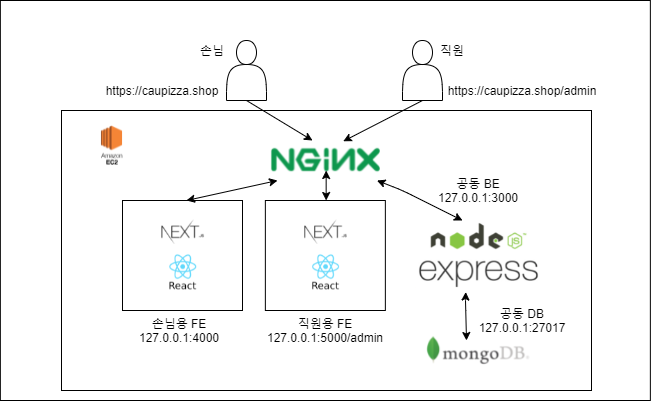

# Project Documents
## Author
김찬현, 장동훈, 안재형, 이지호, 김동욱, 김상렬
## Summary
2021 소프트웨어공학 프로젝트의 문서들의 모임입니다.  
아래에서 **Demo** 와 **Service Architecture** 그리고 **프로젝트 설계**에 대한 문서를 볼 수 있습니다.    
**Subject** 부분부터 본문서는 위에서부터 아래로 시간 순서대로 기술되어 있습니다.  
문서의 흐름 역시 위에서부터 아래로 이어집니다.

## DEMO
### 손님
https://caupizza.shop
### 직원
https://caupizza.shop/admin

## Service Architecture
### 서비스 도식화

### 구조
EC2 위에 NGINX를 웹서버로 올려놓고 Route35 서비스를 이용해서 caupizza.shop 도메인과 연결해두었습니다. EC2 안에는 Next.js 로 작성된 손님용 FE, 직원용 BE 가 존재하고 mongoDB를 DB로 하는 express.js로 작성된 BE가 존재합니다. 각 인스턴스들의 통신은 nginx를 통해서 이루어지며, 각각 독립적으로 동작하며 API명세에 따라서 동작합니다.  

자세한 설계에서 구현 문서사항은 아래 **설계 문서**와 **Overall Project Implementation Doc**에서 확인할 수 있습니다.

### Repositoy

**손님용 FE**  
https://github.com/causwe-bts/BTS-Front  

**직원용 FE**  
https://github.com/causwe-bts/BTS-Front-Admin

**BE**    
https://github.com/causwe-bts/BTS-Backend

**API DOCS**  
https://github.com/causwe-bts/Project-APIDOC

---
## Subject
### Online Pizza Ordering System 
https://nevonprojects.com/online-pizza-ordering-system/

## Problem Statement
/Problem Statement/ 폴더 안에 정의되어 있습니다.   
문제에 대한 정의와, 솔루션 진행 예시 및 유저시나리오를 담고 있습니다.

## Requirements
/Requirements/ 폴더 안에 정의되어 있습니다.   
구체적인 요구사항과 이에 대한 우선순위를 정하고 관리하는 문서모음 입니다.

## Use Cases
/Use Cases/ 폴더 안에 정의되어 있습니다.   
Problem Statements와 Requirements 에서 도출된 내용들을 토대로 각 Use Case 상황에 맞추어 Flow Event Scenario, condition, Actor등이 정의되어 있습니다.

## Domain Model
/Domain Model/ 폴더 안에 정의되어 있습니다.   
각 Use Case별 Extracting the responsibility table, Extracting the Associations table, Extracting the Attributes table 과 해당 Use Case의 Domain Model Diagram이 정의되어 있습니다.

## Mock Design

Online Interactive MockUps  
https://xd.adobe.com/view/bbda639c-b1f7-47c4-9321-7ab548aa4b90-ee89/  

위 링크에서는 User Senario가 반영된 interative 한 mockup을 볼 수 있습니다.

/Mock Design/ 폴더 안에서 각 페이지별 Mock up 디자인을 이미지 형태로 각각 볼 수 있습니다.

## RAD(Sequence Diagram)
/RAD(Sequence Diagram)/ 폴더 안에 정의되어 있습니다.  
Domain 모델과 Use case를 기반으로 각 Design Pattern에 따라 실제 기능명세를 하고 클래스를 정의한 문서가 들어가 있습니다. 서비스의 핵심이 되는 Use Case의 상위 50%를 구현해습니다.

## Class Diagram
/Class Diagram/ 폴더 안에 정의되어 있습니다.   
RAD(Sequence Diagram)을 정의한것을 바탕으로 실제 모델의 Class를 설계하고 Class간의 member varaible과 method 그리고 모델 Class의 관계를 도식화 해서 정리했습니다.  

추가로 해당 Class와 Domain Model에서 정의한 Domain concepts간의 관계를 정의해주는 Traceability Matrix도 정의되어 있습니다.

## Overall Project Implementation Document
/Overall Project Implementation Doc/ 폴더 안에 정의되어 있습니다.   
한 학기 동안 소프트웨어 공학 수업에서 프로젝트를 진행하면서 팀 프로젝트의 협업했던 방식과 구현에 앞서 프로젝트를 진행하면서 작성했던 설계와 다이어그램, 도표 문서들아 실제 구현으로 어떻게 이어졌는지에 대한 설명을 담고 있습니다.